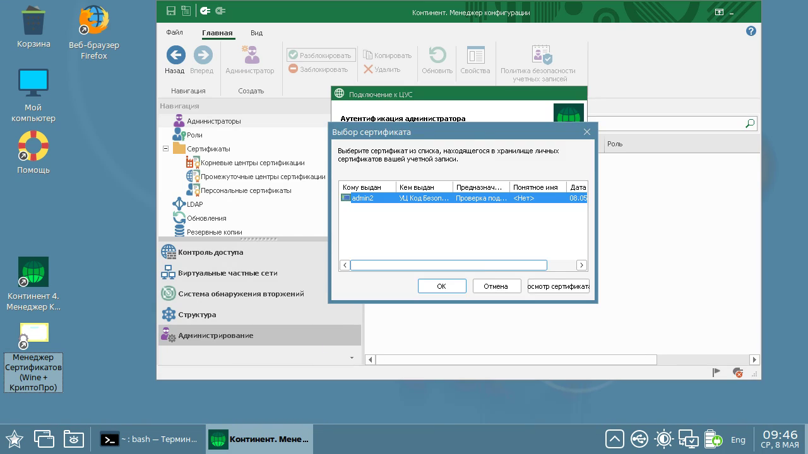

### Континент 4.1.9.2585 Публичный Релиз

- [Установка в Astra Linux](Install-AstraLinux.md#astra-linux)
  - [Установка Wine](Install-AstraLinux.md#установка-wine)
  - [Установка КриптоПро](Install-AstraLinux.md#установка-криптопро)
  - [Установка Менеджера Конфигурации](Install-AstraLinux.md#установка-менеджера-конфигурации)
- [Установка в ALT Linux](Install-ALTLinux.md#astra-linux)
  - [Установка Wine](Install-ALTLinux.md#установка-wine)
  - [Установка КриптоПро](Install-ALTLinux.md#установка-криптопро)
  - [Установка Менеджера Конфигурации](Install-ALTLinux.md#установка-менеджера-конфигурации)
- [Установка в RED OS](Install-REDOS.md#astra-linux)
  - [Установка Wine](Install-REDOS.md#установка-wine)
  - [Установка КриптоПро](Install-REDOS.md#установка-криптопро)
  - [Установка Менеджера Конфигурации](Install-REDOS.md#установка-менеджера-конфигурации)
- [Установка в ROSA Linux](Install-ROSALinux.md#astra-linux)
  - [Установка Wine](Install-ROSALinux.md#установка-wine)
  - [Установка КриптоПро](Install-ROSALinux.md#установка-криптопро)
  - [Установка Менеджера Конфигурации](Install-ROSALinux.md#установка-менеджера-конфигурации)
- [Установка в Ubuntu](Install-Ubuntu.md#ubuntu)
  - [Установка Wine](Install-Ubuntu.md#установка-wine)
  - [Установка КриптоПро](Install-Ubuntu.md#установка-криптопро)
  - [Установка Менеджера Конфигурации](Install-Ubuntu.md#установка-менеджера-конфигурации)
- [Установка в MacOS](Install-MacOS.md#ubuntu)
  - [Установка Wine](Install-MacOS.md#установка-wine)
  - [Установка КриптоПро](Install-MacOS.md#установка-криптопро)
  - [Установка Менеджера Конфигурации](Install-MacOS.md#установка-менеджера-конфигурации)

### Пример использования в Astra Linux

Щелкните по картинке чтобы посмотреть видео

